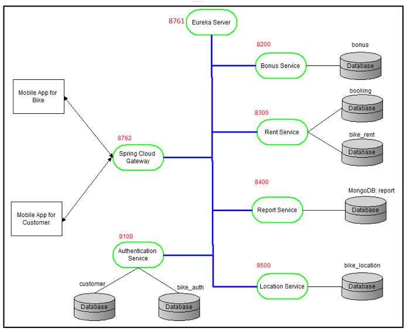
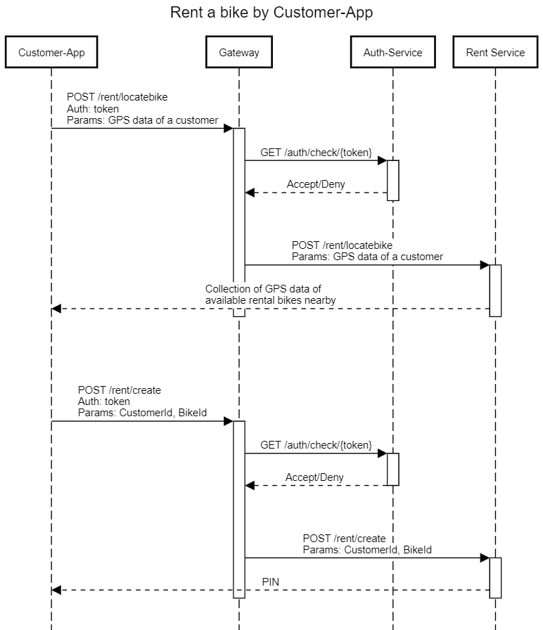
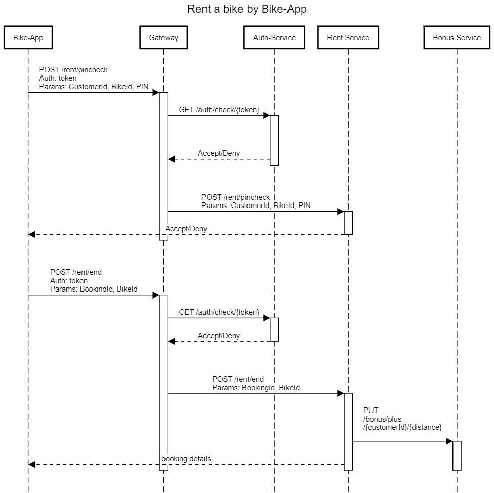

# BikeVerleih
Project: Development of a bicycle rental system using the microservice architecture

Thesis for obtaining the academic degree B.Sc. at the HTW Berlin in the course of studies Applied Computer Science

Bike rental systems offer customers the option of renting a bike when using a mobile application. Along the way, customers can earn bonus points if they report defective
bikes or if the distance traveled is more than 5 km. This bachelor thesis deals with the development of bicycle rental systems consisting of a backend server, a mobile
application for customers and a mobile application for bicycles.

The customer app is responsible for registering, navigating to available bicycles and renting bicycles.

Source: https://github.com/QuangBruder27/BikeCustomer

The main task of the Bike-App is to send the entered PIN code and calculate the ride time and distance traveled.

Source: https://github.com/QuangBruder27/RentalBike

